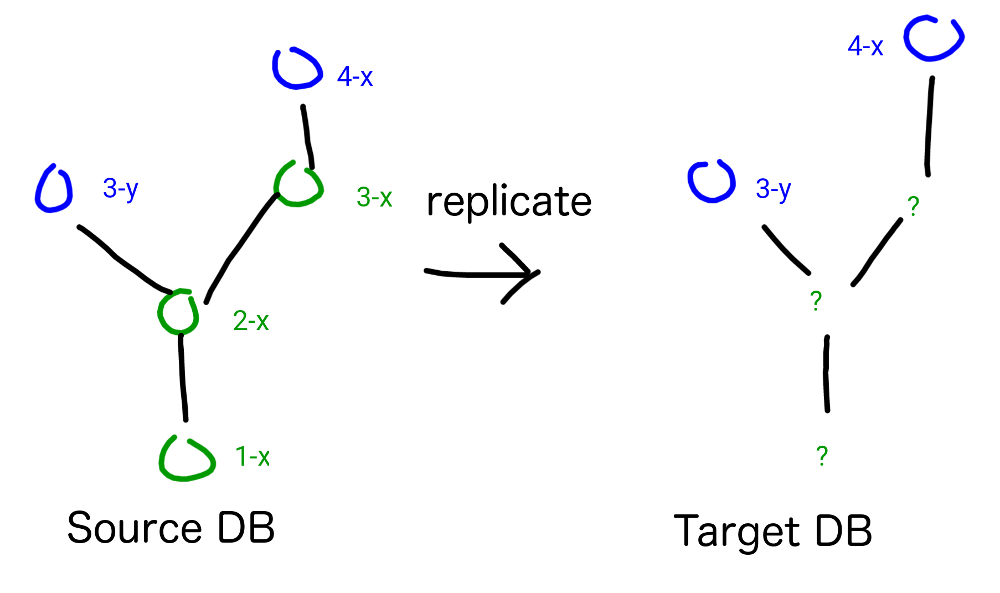
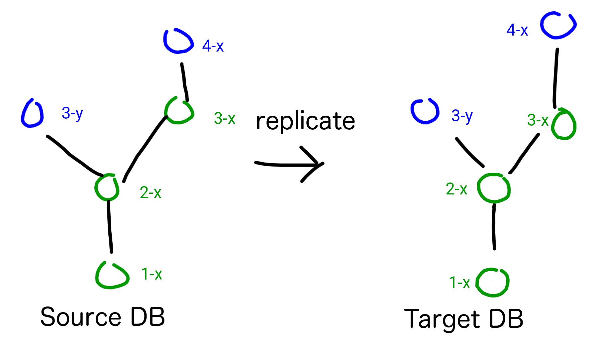

PouchDB Full Sync
=====

[](https://travis-ci.org/nolanlawson/pouchdb-full-sync)

Fully replicate two PouchDB or CouchDB databases, while preserving absolutely all document history and conflicts.

Useful for:

* Implementing infinite undo/redo in your app
* Building a Git-like VCS on top of CouchDB/PouchDB
* Building a collaborative wiki, where all edits ever are preserved

Description
----

Normally, the CouchDB replication protocol only replicates the **leafs** between two databases. This preserves conflicts (which is awesome!), but it discards **non-leafs** for performance reasons.

You can visualize it like this. Here's what CouchDB/PouchDB normally does:



The non-leaf revisions `1-x`, `2-x`, and `3-x` are lost during replication, but the conflicting leafs `3-y` and `4-x` are kept. If you try to fetch the non-leafs from the target database using `db.get('id', {rev: '1-x'})`, then you'll see `{"error": "not_found", "reason": "missing"}`.

Incidentally, this is the same thing that happens during [compaction](http://pouchdb.com/api.html#compaction).

Now, here's what PouchDB Full Sync does:



Notice that all the revisions are kept, even the non-leafs. So you can call `db.get('id', {rev: '1-x'})` and the data will be there!

Usage
----

### In the browser

To use this plugin in the browser, include it after `pouchdb.js` in your HTML page:

```html
<script src="pouchdb.js"></script>
<script src="pouchdb.full-sync.js"></script>
```

It's also available from Bower:

    bower install pouchdb-full-sync

### In Node.js/Browserify

Or to use it in Node.js, just npm install it:

```
npm install pouchdb-full-sync
```

And then attach it to the `PouchDB` object:

```js
var PouchDB = require('pouchdb');
PouchDB.plugin(require('pouchdb-full-sync'));
```

API
---

There are three new methods, which have exactly the same APIs as the old methods:

* `db.fullyReplicateTo()` emulates `db.replicate.to()`
* `db.fullyReplicateFrom()` emulates `db.replicate.from()` 
* `db.fullySync()` emulates `db.sync()`

So you will want to refer to the original documentation for [`replicate()`](http://pouchdb.com/api.html#replication) and [`sync()`](pouchdb.com/api.html#sync) to understand how to use this plugin.

Examples:

```js
var db = new PouchDB('mydb');
var remoteDB = new PouchDB('http://localhost:5984/mydb');

// fully replicate to another database
db.fullyReplicateTo(remoteDB);

// fully replicate from another database
db.fullyReplicateFrom(remoteDB);

// fully sync two databases
db.fullySync(remoteDB);
```

The same promise/callback/event APIs are supported. So e.g. you can do a one-shot replication with promises:


```js
db.fullySync(remoteDB).then(function () {
  // all done!
}).catch(function (err) {
  // got an error!
});
```

Or you can use the familiar event listeners:

```js
db.fullySync(remoteDB, {
  live: true,
  retry: true
}).on('change', function (info) {
  // handle change
}).on('paused', function () {
  // replication paused (e.g. user went offline)
}).on('active', function () {
  // replicate resumed (e.g. user went back online)
}).on('denied', function (info) {
  // a document failed to replicate, e.g. due to permissions
}).on('complete', function (info) {
  // handle complete
}).on('error', function (err) {
  // handle error
});
```

Caveats
---

If you want to permanently preserve history, you should never call `compact()` or enable `auto_compaction`. Once you compact, the non-leaf revisions in that database are lost.

Also, your database can grow wildly out of control, because CouchDB/PouchDB is storing your full document history. Be cognizant of [browser data limits](http://pouchdb.com/faq.html#data_limits).

Also, be forewarned that CouchDB 2.0 will deprecate the `_compact` API, meaning that it will compact whenever it deems necessary. So at that point, you may need to stick with CouchDB 1.x or PouchDB Server.

This plugin also supports replicating between two CouchDBs (since PouchDB itself can do that), but note that the changes will flow through PouchDB, rather than using the CouchDB replicator at the `/_replicate` endpoint.

PouchDB currently has a hard limit of 1,000 revisions ([unless you help fix it :smile:](https://github.com/pouchdb/pouchdb/issues/2839)), at which point it will cut off the revision history. CouchDB has a [`_revs_limit` API](https://wiki.apache.org/couchdb/HTTP_database_API#Accessing_Database-specific_options) which you can use to configure the limit.

This algorithm is also less efficient than PouchDB's original replication algorithm, because it involves more `GET` requests to fetch the parent revisions. When the [bulk revs API](https://issues.apache.org/jira/browse/COUCHDB-2310) is finished, it can be improved.

Building
----

    npm install
    npm run build

Testing
----

### In Node

This will run the tests in Node using LevelDB:

    npm test
    
You can also check for 100% code coverage using:

    npm run coverage

If you don't like the coverage results, change the values from 100 to something else in `package.json`, or add `/*istanbul ignore */` comments.

### In the browser

Run `npm run dev` and then point your favorite browser to [http://127.0.0.1:8001/test/index.html](http://127.0.0.1:8001/test/index.html).

The query param `?grep=mysearch` will search for tests matching `mysearch`.

### Automated browser tests

You can run e.g.

    CLIENT=selenium:firefox npm test
    CLIENT=selenium:phantomjs npm test

This will run the tests automatically and the process will exit with a 0 or a 1 when it's done. Firefox uses IndexedDB, and PhantomJS uses WebSQL.
